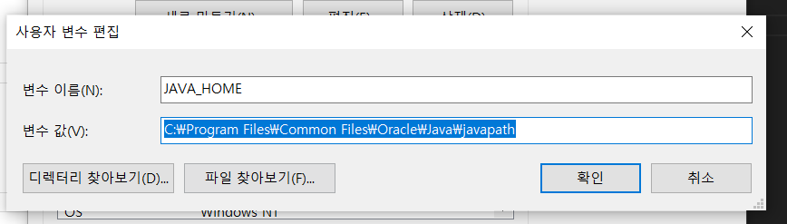

# REACT-NATIVE

## 윈도우 세팅하기

1.  window powershell 에서 choco 써보고
    Chocolatey v1.2.0(버전 다를수 있음)
    Please run 'choco -?' or 'choco <command> -?' for help menu.
    나오면 깔려있는거 없으면 직접 설치해야함
    https://chocolatey.org/install

2.  choco install -y nodejs-lts microsoft-openjdk11

3.  android studio 설치
    Android SDK에서
    
    30버전으로 설치
    
    이미지와같이 설치

4.  환경변수 설정
    환경변수 검색해서 
    변수명 ANDROID_HOME 설치한 sdk 폴더랑 연결
    JAVA_HOME 변수 설정

#### javac 설치경로 확인하는 방법

git bash 열어서 which choco, which javac 하면 경로 나옴
(없으면 java부터 설치해야함)
