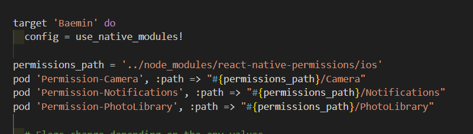

# REACT-NATIVE

## 공식사이트

리액트 공식사이트 : <https://reactnative.dev/>

리액트 네비게이션사이트(Route) : <https://reactnavigation.org/>

## 윈도우 세팅하기

1.  window powershell 에서 choco 써보고
    Chocolatey v1.2.0(버전 다를수 있음)
    Please run 'choco -?' or 'choco <command> -?' for help menu.
    나오면 깔려있는거 없으면 직접 설치해야함
    <https://chocolatey.org/install>

2.  choco install -y nodejs-lts microsoft-openjdk11

3.  android studio 설치
    Android SDK에서
    
    30버전으로 설치
    
    이미지와같이 설치

4.  환경변수 설정
    환경변수 검색해서 
    변수명 ANDROID_HOME 설치한 sdk 폴더랑 연결
    자바설치하고
    JAVA_HOME 변수 설정!! -> git bash로 경로 찾아서 연결

> javac 설치경로 확인하는 방법

git bash 열어서 which choco, which javac 하면 경로 나옴
(없으면 java부터 설치해야함)

## MAC IOS+Window 셋팅 (ios는 macbook 있어야함...)

1.  터미널 켜서 which brew 해서 버전 안나오면
    <https://brew.sh/> 가서 설치

2.  brew install node, brew install watchman 설치

brew tap homebrew/cask-versions

brew install --cask zulu11

<https://reactnative.dev/docs/environment-setup?guide=native&platform=android&os=macos&package-manager=npm> 참고

3. 앱스토어로 가서 xcode 설치

4. android studio 맥용으로 설치

5. 환경변수 설정 <https://kitty-geno.tistory.com/166>

6. command line tools 설치 <https://reactnative.dev/docs/environment-setup?guide=native&platform=ios&os=macos&package-manager=npm> 참고

7. sudo gem install cocoapods

8. 프로젝트 생성

9. xcode로 workspace 열어주기

---

## react-native 설치

npm i -g react-native

react-native init 프로젝트명 --template react-native-template-typescript

## android studio 셋팅

 오른쪽 위 버튼 클릭

 create device

대충 작은 디바이스 선택하고(갤럭시 폴드같은거) next 누르고 R 다운로드

터미널에서 npm run android

## 에뮬레이터 실행 안될때

https://ninedc.tistory.com/71 참고(JAVA 버전 높아서 생기는 문제)

powershell 관리자권한으로 실행

npx react-native run-android
cd android
./gradlew wrapper clean
cd ..
npx react-native run-android

## flipper 설치

(console이나 devtool 확인하는거)

powshell 관리자로 열어서 choco install openssl

(ios는 watchman도 설치)

npm i react-native-flipper redux-flipper rn-async-storage-flipper @react-native-async-storage/async-storage --force

### flipper plugin 추천

async-storage

redux-debugger

## 앱이름 바꾸는법


1. app.json에 displayName 변경
2. android>app>src>main>res>values>strings.xml 에서 app_name 변경
3. ios> 파일명> info.plist 에서 원래이름부분 변경

```
<key>CFBundleDisplayName</key>
<string>원래이름</string>
```

## 라우터(네비) 설치

npm i @react-navigation/native @react-navigation/native-stack
npm i react-native-screens react-native-safe-area-context

cd ios > npx pod-install (ios 전용)

npm install @react-navigation/bottom-tabs

## Components

참고 : <https://reactnative.dev/docs/components-and-apis>

### 버튼의 종류

제일 기본적인거 : Pressable (나머지는 운영체제마다 다르게 나타날수있어서)

Pressable, TouchableNativeFeedback, TouchableOpacity, TouchableHighlight, TouchableWithoutFeedback

### 키보드 라이브러리(키보드가 창 안가리도록)

npm i react-native-keyboard-aware-scrollview --force

## 리덕스 설정

npm i @reduxjs/toolkit react-redux redux-flipper

Provider 안에서만 userSelector 등을 쓸 수 있는데 그래서 Appinner를 분리해준다

## API

### axios 설치

npm i axios --force

useCallback에선 async 쓸수있다

### loading 관련 꿀팁

버튼에서 광클하는 인간들이 있다.. 그래서 로딩중일땐 버튼의 기능을 막아놔야한다 disabled={loading}

react-native에서는 도넛로딩애니메이션을 지원하는 컴포넌트가 있다 ActivityIndicator

### 환경변수 관리

npm i react-native-dotenv

babel.config.js

```
module.exports = {
 "presets": ["module:metro-react-native-babel-preset"],
 "plugins": [
   ["module:react-native-dotenv", {
     "moduleName": "@env",
     "path": ".env",
     "blacklist": null,
     "whitelist": null,
     "safe": true,
     "allowUndefined": true
   }]
 ]
};
```

.env파일 생성

```
API_KEY=123456789abcdefghijk
```

.env.d.ts 파일 생성

```
declare module '@env' {
  export const API_KEY: string;
}
```

import {API_KEY} from '@env';

### http 통신 허용방법

<https://velog.io/@ddowoo/react-native-http%ED%86%B5%EC%8B%A0-%ED%97%88%EC%9A%A9-%EB%B0%A9%EB%B2%95-AOS-iOS>

### 스토리지

#### 일반적인 스토리지

import {AsyncStorage} from 'react-native'

#### 보안에 민감한 스토리지

react-native-encrypted-storage

> 스토리지별 성능차이

Redux : 앱을 끄면 데이터가 사라짐 / 보안높음

AsyncStrage : 앱을 꺼도 데이터가 남음 / 보안낮음(완전오픈)

react-native-encrypted-storage : 앱을 꺼도 데이터가 남음 / 보안높음

#### Token

accessToken은 보통 5분,10분 가지고있는 일시적인 토큰

refreshToken은 1일,30일,1년 장기적으로 가지고있는 토큰(보안 빡세게해야함)

보통 access는 redux에, refresh는 encrypted-storage에 따로 저장하는게 좋다

### 웹소켓 기반 라이브러리(실시간 서버통신)

npm i socket.io-client

### FlatList (ScrollView 대체)

서버에서 내려주는 데이터와 반복문의 조합일 경우 ScrollView 말고 FlatList를 사용한다

```
<FlatList
    data={orders}
    keyExtractor={item => item.orderId}
    renderItem={renderItem}
/>
```

### accessToken 갱신하는 방법

interceptors 사용

### 배포명 바꾸는법

android>app>src>main>java>com>이름

들어있던걸 com>새폴더>이름 이렇게하면 이름이 추가된다

마찬가지로 android>app>src>debug>java>com>새폴더>이름 이렇게 폴더 중첩시키고

com.이름 으로 되어있는걸 검색해서 나오는것들 모두 com.새폴더.이름으로 변경해준다

### 권한얻기

npm i react-native-permissions

#### IOS

> ios/Podfile



> ios/이름/info.plist

NSLocationWhenInUseUsageDescription 위에

```
<key>NSCameraUsageDescription</key>
<string>배송완료 사진 촬영을 위해 카메라 권한이 필요합니다.</string>
<key>NSPhotoLibraryAddUsageDescription</key>
<string>배송완료 사진 선택을 위해 라이브러리 접근 권한이 필요합니다.</string>
<key>NSPhotoLibraryUsageDescription</key>
<string>배송완료 사진 선택을 위해 라이브러리 접근 권한이 필요합니다.</string>
```

#### Android

> android/app/src/main/AndroidManifest.xml

```
<uses-permission android:name="android.permission.INTERNET" />
<uses-permission android:name="android.permission.CAMERA"/>
<uses-permission android:name="android.permission.READ_EXTERNAL_STORAGE"/>
<uses-permission android:name="android.permission.WRITE_EXTERNAL_STORAGE"/>
<uses-permission android:name="android.permission.VIBRATE"/>
<uses-permission android:name="android.permission.READ_MEDIA_IMAGES" />
```

아이폰이면 npx pod-install

\*\* 권한설정할때 설명 안넣으면 앱 출시할때 거절먹음...

### OS 구분하기

import { Platform} from 'react-native';

if(Platform.OS === 'android')

### 이미지크롭

npm i react-native-image-crop-picker react-native-image-resizer

### 이미지 form 데이터로 업로드하기

```
uri: 경로,
name: 이름,
type: 확장자,
```

### 스플래시 스크린 & 아이콘

npm i react-native-splash-screen

[스플래시](https://velog.io/@chloedev/React-native-Splash-Screen-%EC%A0%81%EC%9A%A9%ED%95%98%EA%B8%B0-iOS-android) 참고

[아이콘](https://velog.io/@chloedev/React-native-%EC%95%B1-%EC%95%84%EC%9D%B4%EC%BD%98-%EC%84%A4%EC%A0%95%ED%95%98%EA%B8%B0)

```
import SplashScreen from 'react-native-splash-screen';
SplashScreen.hide();
```

### 푸시알림 (onesignal)

> onesignal
> [참고](https://medium.com/crossplatformkorea/onesignal-%EB%A6%AC%EC%97%91%ED%8A%B8%EB%84%A4%EC%9D%B4%ED%8B%B0%EB%B8%8C-sdk-%EC%84%A4%EC%B9%98-%EB%B0%A9%EB%B2%95-%EB%B0%8F-%EA%B0%84%EB%8B%A8%ED%95%9C-%EC%82%AC%EC%9A%A9%EB%B2%95-6a7fd1058ee7)

> firebase
> npm i @react-native-firebase/analytics @react-native-firebase/app @react-native-firebase/messaging
> npm i react-native-push-notification @react-native-community/push-notification-ios
> npm i -D @types/react-native-push-notification

### USB로 실제 기기 연결

> 갤럭시 기준 [참고](https://m.blog.naver.com/leemonpai/222976231731)

### 코드푸시

앱스토어 심사중에는 코드푸시 넣지 말것

[앱센터 가입](https://appcenter.ms/)

[여기서 앱 만들기](https://appcenter.ms/sign-in?original_url=%2Fapps%2Fcreate) - ios, android 따로
